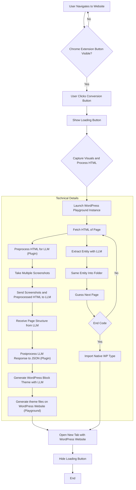

# Process Chart

```mermaid
graph TD
    UserNavigatesWebsite[User Navigates to Website] --> CheckExtensionButtonVisibility{Chrome Extension Button Visible?};
    CheckExtensionButtonVisibility -- Yes --> UserClicksConversionButton[User Clicks Conversion Button];
    CheckExtensionButtonVisibility -- No --> UserNavigatesWebsite;
    UserClicksConversionButton --> ShowLoadingButton[Show Loading Button];
    ShowLoadingButton --> CaptureVisualsAndProcessHTML{Capture Visuals and Process HTML};
    CaptureVisualsAndProcessHTML --> LaunchWordPressPlayground[Launch WordPress Playground Instance];
    LaunchWordPressPlayground --> FetchPageHTML[Fetch HTML of Page];
    FetchPageHTML --> PreprocessHTMLForLLM["Preprocess HTML for LLM (Plugin)"];
    PreprocessHTMLForLLM --> CapturePageScreenshots[Take Multiple Screenshots];
    CapturePageScreenshots --> SendDataToLLM[Send Screenshots and Preprocessed HTML to LLM];
    SendDataToLLM --> ReceiveLLMPageStructure[Receive Page Structure from LLM];
    ReceiveLLMPageStructure --> PostprocessLLMResponse["Postprocess LLM Response to JSON (Plugin)"];
    PostprocessLLMResponse --> QueryLLMForGeneratingBlock[Generate WordPress Block Theme with LLM];
    QueryLLMForGeneratingBlock --> GenerateThemeFiles["Generate theme files on WordPress Website (Playground)"];
    GenerateThemeFiles --> OpenNewTabWithWordPress[Open New Tab with WordPress Website];
    OpenNewTabWithWordPress --> HideLoadingButton[Hide Loading Button];
    HideLoadingButton --> ProcessComplete[End];
    FetchPageHTML --> ExtractEntity["Extract Entity with LLM"];
    ExtractEntity --> SameEntityIntoFolder["Same Entity Into Folder"];
    SameEntityIntoFolder --> GuessNextPage["Guess Next Page"];
    GuessNextPage --> EndCode{End Code};
    EndCode -- Yes --> ImportNativeWPType["Import Native WP Type"];
    EndCode -- No --> FetchPageHTML;
    ImportNativeWPType --> OpenNewTabWithWordPress

    subgraph Technical Details
        LaunchWordPressPlayground;
        FetchPageHTML;
        PreprocessHTMLForLLM;
        CapturePageScreenshots;
        SendDataToLLM;
        QueryLLMForGeneratingBlock;
        GenerateThemeFiles;
        ReceiveLLMPageStructure;
        PostprocessLLMResponse;
        ExtractEntity;
        SameEntityIntoFolder;
        GuessNextPage;
        EndCode;
        ImportNativeWPType;
    end
```

